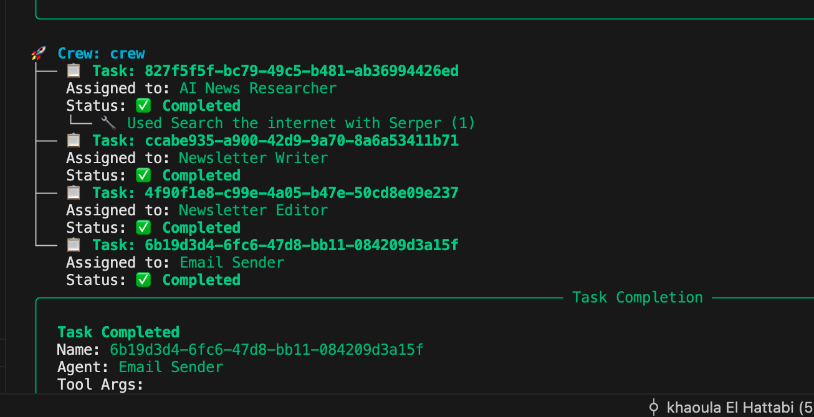

# GenAI Newsletter Agent

GenAI Newsletter Agent is a full-stack automation project that demonstrates advanced Python engineering, agent-based orchestration, and real-world impact. It automatically researches, generates, structures, and sends a weekly newsletter about the latest developments in Artificial Intelligence, using state-of-the-art tools and APIs.

## Why This Project 

- **End-to-End Automation:** From data gathering to content creation and delivery, everything is automated.
- **Teamwork & Modularity:** Four specialized agents (Researcher, Writer, Editor, Sender) collaborate, reflecting real-world team workflows.
- **Modern Stack:** CrewAI for agent orchestration, Langchain for tool integration, and LLMs for natural language generation.
- **Production-Ready:** HTML email delivery, environment variable management, and error handling.
- **Customizable & Scalable:** Easily adapt templates, agent roles, and workflows for new domains or languages.

## Technical Highlights
- **Python 3.10+**
- **CrewAI**: Multi-agent orchestration
- **Langchain**: Tool and LLM integration
- **SerperDevTool**: Web search API
- **Pydantic**: Data validation
- **SMTP**: Email delivery
- **dotenv**: Secure environment management

---

## 💡 How It Works

1. **Researcher Agent:** Finds the latest AI news using web search APIs.
2. **Writer Agent:** Summarizes articles and generates catchy French titles.
3. **Editor Agent:** Structures the newsletter with a responsive HTML template.
4. **Sender Agent:** Delivers the newsletter via email to subscribers.

---

## ⚡ Quickstart

```bash
# Clone the repository
git clone https://github.com/KhaoulaElHattabi/newsletter_agent.git
cd newsletter_agent

# Install dependencies
python -m venv venv
source venv/bin/activate
pip install -r requirements.txt

# Configure environment variables
cp .env.example .env  # Fill in your API keys and email credentials

# Add your banner image
# Place banner.jpg in the project root

# Run the main script
python main.py
```

---

## 🎨 Customization

- **Newsletter Template:** Edit `newsletter_template.py` for HTML structure and style.
- **Agents & Tasks:** Modify `agents.py` and `tasks.py` to adjust agent roles, goals, and workflow.

---

## 🏗️ Project Structure

```
newsletter_agent/
├── .env
├── README.md
├── assets/
├── crewagents/
│   ├── __init__.py
│   ├── agents.py
│   ├── azure_llm.py
│   ├── image.png
│   ├── main.py
│   ├── newsletter_template.py
│   ├── requirements.txt
│   ├── tasks.py
│   ├── test_image.py
│   ├── tool.py
├── venv/
```

---

## 📈 Technical Aspects

- Python best practices for automation and modularity
- Multi-agent system design and orchestration
- API integration and secure credential management
- HTML email generation and delivery
- Error handling and production readiness

---

## 📸 Screenshots

Below are workflow and example screenshots of newsletters sent using GenAI Newsletter Agent:

### Workflow Example


### Newsletter Example
 


## 🤝 Contributing
Pull requests are welcome! For major changes, please open an issue first to discuss what you would like to change.


## 📬 Contact Me
For collaboration, questions, or freelance opportunities, feel free to reach out:

- Email: khaoula.elhattabi1@gmail.com


